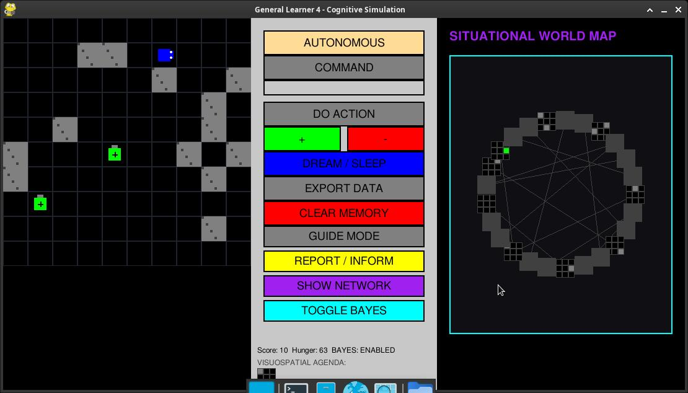
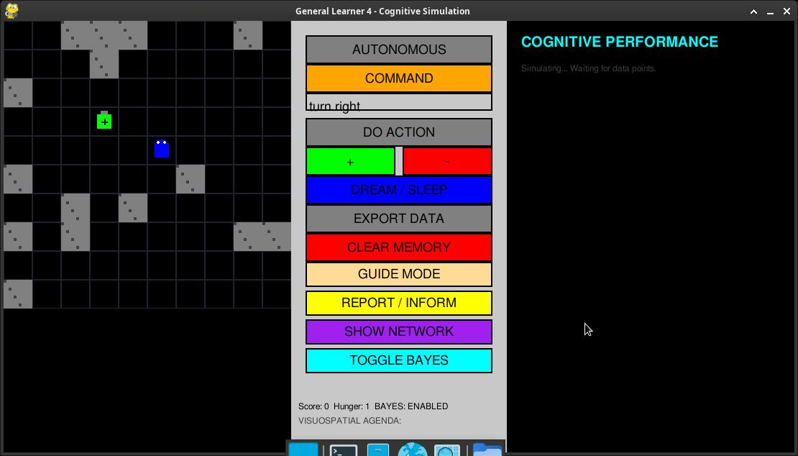
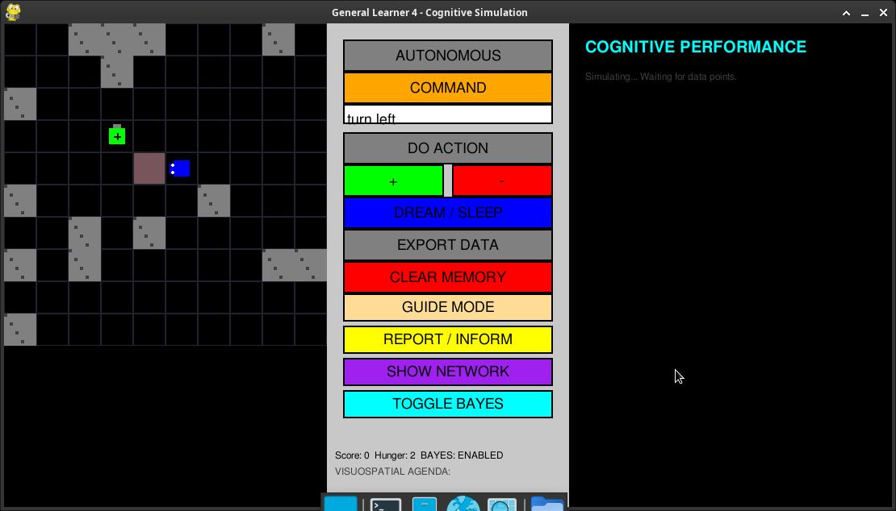

# General Learner 4 (GL4): A Cognitive Autonomous Architecture

General Learner 4 (GL4) is an advanced autonomous agent inspired by the **Universal Learner model** (Fritz et al., 1989) and contemporary hippocampal research. This project demonstrates emergent situational mapping, probabilistic decision-making, and biological homeostasis within a real-time 2D simulation.

---

## 📽️ System Demonstration
### Watch General Learner 4 in Action


---

## 🔬 Cognitive Architecture (The 4 Pillars)

The GL4 architecture separates raw perception from logical representation, allowing for high-level "Mental Imagery" and adaptive planning.

### 1. Situational World Map (Hippocampal Locale Mapping)
Inspired by **O'Keefe & Nadel**, the agent constructs a **Directed Conceptual Graph**:
- **Nodes**: Each unique 3x3 visual pattern ($S_n$) is treated as a stable "Landmark".
- **Edges**: The agent learns the transition $(S_1, A) \to S_2$.
- **Graph Utility**: This allows the agent to treat the environment as a relational network, enabling it to calculate shortcuts and navigate without a pre-defined coordinate system.


*Figure 1: The Situational Network showing the robot's internal representation of the environment.*

### 2. Visuospatial Agenda (Mental Simulation)
The system maintains a **Visuospatial Sketchpad** (Working Memory):
- When a distal goal is detected, the agent performs a mental BFS (Breadth-First Search) through its Situational Map.
- It generates an **Agenda**: a sequence of future "Expected Landmarks."
- As it moves, it pops these from its mental stack, effectively "walking through" its own mental imagery.

### 3. Bayesian Thompson Sampling (Probabilistic Decision Engine)
To balance exploration and exploitation, GL4 utilizes **Bayesian Inference**:
- **Beta Distribution**: Each action is a probability curve.
- **Uncertainty Management**: Early in learning, the curves are wide (High Uncertainty). As rules are reinforced, the curves tighten around their mean.
- **Dynamic Sampling**: The robot "samples" its beliefs for every step, leading to more "curious" behavior when rules are weak and "decisive" behavior when rules are expert-level.

### 4. Biological Homeostasis & Forgetting
The system implements a biological maintenance cycle (Sleep/Dream):
- **Ebbinghaus Forgetting Curve**: Memories decay over time to prevent cognitive overload.
- **Differential Decay**: Crucial spatial landmarks enjoy a **Protected Status** (5x slower decay), ensuring the robot never truly "gets lost" even if it forgets specific behavioral shortcuts.
- **Consolidation**: During the "Dream" phase, episodic experiences (short-term) are filtered and converted into permanent semantic rules.

---

## 🎮 Operational Modes

GL4 supports multiple levels of interaction and training:

### 🏙️ Autonomous & Command Modes
The robot can navigate purely by its internal drives or follow direct logical string commands ("MoveForward", "FindBattery").


*Figure 2: The Direct Command and Homeostatic Sidebar.*

### 🦮 Guided Mode (Vicarious Learning)
In Guided Mode, the user can "lead" the robot through a path. The robot performs **Vicarious Learning**, absorbing the user's expertise directly into its Situational Map.


*Figure 3: Guided Mode highlighting the robot's prediction of intended target cells.*

### 📊 Performance Inform / Report
The **Cognitive Dashboard** provides real-time telemetry on learning efficiency, rule consolidation, and objective achievement.


*Figure 4: The Performance Analytics panel displaying live learning trends.*

---

## 🛠️ Technical Implementation
- **Architecture**: Separated Model-View-Controller (SoC).
- **Persistence**: SQLite (Chronological Episodic & Semantic Memory).
- **Learning**: Reinforcement Learning (Weight Propagation).
- **Navigation**: Graph-based Pathfinding (BFS).

## 🚀 Installation & Usage
1. **Requirements**: Python 3.11+, PyGame, SQLite3.
2. **Run**:
   ```bash
   python main.py
   ```
3. **Training**: Use **GUIDE MODE** to teach the robot landmarks, then switch to **AUTONOMOUS** to watch it navigate using its Cognitive Map.

---
*Developed by Marco Baturan | Based on the Universal Learner Paradigms (1989).*
