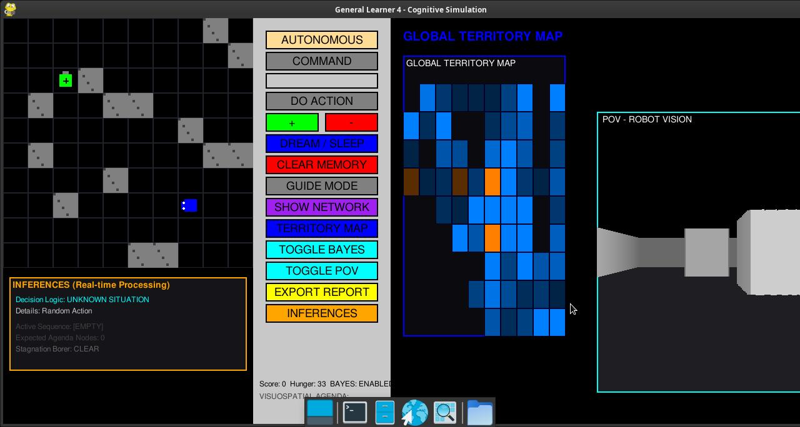
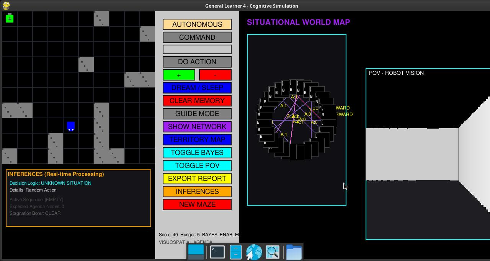

# Symbolic Cognitive Architecture: A Fuzzy Bayesian Approach to Autonomous Agents

**Authors**: Marco, W. Grey Walter (in memoriam), W. Fritz (in memoriam)

## Abstract

This paper details the evolution and mechanics of the *General Learner 4 (GL4)*, an autonomous intelligent system exploring the intersection of Fuzzy Logic, Bayesian Action Selection, and Asymptotic Memory Decay. Built upon the pioneering cybernetic frameworks of W. Grey Walter's tortoises and W. Fritz's General Learner series, GL4 demonstrates how an agent can iteratively construct a functional understanding of its environment through symbolic grounding and reinforcement learning, free of hardcoded linguistic keywords.

[**Watch the Live GL4 System Demonstration**](assets/GL4-2026-04-06.mp4)

---

## 1. Introduction & Cybernetic Lineage

The history of autonomous mobile robotics is deeply rooted in attempts to replicate biological homeostasis and stimulus-response arcs. In the late 1940s, **W. Grey Walter** developed autonomous robotic "tortoises" (Machina speculatrix), designed to demonstrate that complex behavior can emerge from simple, interconnected analog circuits prioritizing survival mechanisms like light-seeking and battery recharging [1]. 

Extending this biological analogy into the computational realm, **W. Fritz** introduced the *General Learner* program in the 1990s [2]. Fritz sought to model cognitive architectures not through monolithic expert systems, but through dynamic, biologically-inspired processes mimicking the neural column behavior of organic brains experiencing conditioning.

Furthermore, we heavily rely on the pedagogical and foundational cybernetics exploration provided by **J. Andrade** in *Thinking with the Teachable Machine* [3], which posits that machine intelligence is best incubated through interactive, iterative teaching loops between the agent and its environment, rather than a priori rule programming.

The General Learner 4 serves as the modern culmination of these philosophies.

---

## 2. Core Architectural Components

### 2.1 Fuzzy Perceptual Vectors (Fuzzification)
Biological agents do not perceive the world in strict binary measurements. In 1965, **Lotfi A. Zadeh** developed **Fuzzy Logic** to formally represent degrees of truth [4]. 

In GL4, the agent's ultrasonic distance sensors and internal homeostatic needs (e.g., tiredness) are not processed as absolute integers. A dedicated `FBN` (Fuzzy Bayesian Network) module maps these raw values to linguistic concepts (e.g., `MURO_NORTE:CERCA`, `CANSANCIO:ALTO`) using specific membership functions (Triangular and Trapezoidal). 

### 2.2 Agnostic Symbolic Grounding
A fundamental leap in GL4 is its language agnosticism. Previous iterations relied on English or Spanish keywords. GL4 employs a `Tokenizer` that parses arbitrary strings into internal `conceptual_ids`. Meaning is not pre-assigned; it is derived via positive reinforcement when an arbitrary sound/text correlates with an action that decreases homeostatic stress.

### 2.3 Thompson Sampling (Exploration vs. Exploitation)
Action selection in uncertain environments represents a classic multi-armed bandit problem. Rather than employing purely greedy or epsilon-greedy strategies, GL4 utilizes **Thompson Sampling** [5]. 

Proposed initially by William R. Thompson in 1933, this heuristic algorithm maintains a probability distribution representing the agent's "belief" regarding the expected reward of actions. Actions with high uncertainty have wider distributions (encouraging exploration), while repeatedly successful actions narrow in variance (encouraging exploitation). GL4 calculates the probability of rule success using the Beta distribution, $B(\alpha, \beta)$, formed by historic successes and failures.

### 2.4 Asymptotic Forgetting Curve
To prevent database bloat and ensure cognitive flexibility, GL4 simulates the **Ebbinghaus Forgetting Curve** [6].

First theorized by Hermann Ebbinghaus in 1885, the forgetting curve demonstrates the exponential loss of memory retention over time. During GL4's "sleep cycles" (consolidation events triggered by low battery), the weights of associative rules are diminished asymptotically (`weight * DECAY_RATE`). Synaptic connections (rules) that fall below the `FORGET_THRESHOLD` are permanently pruned from the SQLite cortex, ensuring the agent adapts to dynamic environments rather than remaining paralyzed by outdated information.

---

## 3. System Analysis and Visual Evidence

The architecture provides a robust suite of diagnostic visualizers to monitor the agent's cognitive state.

### 3.1 The Synthesized Reality Engine (POV)
The agent operates within a grid, but localizes using a pseudo-3D raycasting technique mimicking optical perception.

### 3.2 Situational Concept Network
This represents the agent's short-term working memory. Nodes represent fuzzy state vectors, and edges denote the semantic paths (actions and parsed text commands) connecting them. 

### 3.3 Global Hippocampal Territory Map
The global map visualization records spatial exploration, utilizing a heat-map overlay to denote visit frequency (`visits`) and experiential relevance (`importance`), serving as the robot's functional Hippocampus.

### 3.4 Command Induction and Consolidation
Through the sleep cycle, sequences of basic atomic actions are synthesized into composite macro commands, significantly reducing processing overhead for recurring navigation sequences.

### 3.5 System Interaction & Vicarious Modes
The UI provides detailed feedback arrays, exporting full behavioral analytics when required.

### 3.6 Performance Inform & Telemetry
The integrated cognitive dashboard continuously renders the state of the agent's memory banks, allowing observers to visualize weight changes during active Thompson Sampling.

### 3.7 Core Architectural Codebase State

### 3.8 Real-Time Cognitive Inferences Monitor
A dedicated sub-window below the 2D world view surfaces the agent's internal decision logic on every cycle. The monitor exposes which cognitive pathway is currently driving behavior: **Thompson Sampling** (with per-action Bayesian weights), **Macro Pattern Execution**, **Token Decomposition**, **Associative Memory**, or **Obsession Loop Break**. This provides a direct, interpretable window into the agent's moment-to-moment reasoning process.

### 3.9 Anti-Obsession Saturation Mechanism & Maze Regeneration
To prevent behavioral fixation (analogous to pathological conditioning loops), GL4 incorporates an **Action Saturation Detector**. When 4 or more identical consecutive actions are registered in `action_history`, the system classifies the agent as `STAGNANT (Obsession)` and applies a deterministic counter-action (e.g., FORWARD breaks rotation loops; a TURN breaks wall-collision loops), with an 80% / 20% forced/random split. 

The **NEW MAZE** button allows the researcher to regenerate the environment entirely in place, testing the agent's ability to transfer prior learned rules to novel topologies without resetting memory — a critical test of cognitive generalization.

---

## 4. Future Research Directions

GL4 represents a functional cognitive substrate. The following theoretical extensions are proposed as a roadmap for the next research phase.

### 4.1 Relational Frame Theory (RFT): From Behaviorism to Cognitivism

The dominant paradigm underlying GL4's current learning engine is **Operant Conditioning** (Skinner, 1938): the agent increases or decreases the frequency of behaviors based on environmental consequences (rewards and punishments via `weight` updates). While sufficient for generating adaptive behavior, this paradigm cannot model the full scope of human-level symbolic cognition.

**Relational Frame Theory (RFT)**, developed by **Steven C. Hayes et al. (2001)** [7], proposes that the defining feature of human cognition is the capacity for *derived relational responding* — the ability to frame stimuli in terms of **arbitrarily applicable relations** (e.g., *same as*, *opposite of*, *more than*, *part of*) without direct conditioning.

This represents the critical bridge from behaviorism into cognitivism: the agent does not need to directly experience that `A > B` and `B > C` to derive that `A > C`. It constructs this transitivity from its relational repertoire. This "bidirectionality" of derived relations (if trainer conditions `A→B`, the agent derives `B→A` without training) is a fundamental distinction between biological cognition and current GL4 behavior.

**Proposed Implementation for GL4-RFT:**

| RFT Frame | GL4 Equivalent | Implementation Sketch |
|---|---|---|
| Coordination (same as) | Synonym token clustering | Merge `conceptual_ids` with high co-occurrence scores |
| Opposition (opposite of) | Antonym action pairing | Infer `negative_action` automatically from positive reinforcement history |
| Hierarchy (part of) | Macro decomposition | Current `macro_actions` already models part-whole relations; extend to recursive nesting |
| Causal (if/then) | Transition rules | Current `perception_pattern → next_perception` rules; formalize causality tracking |
| Temporal (before/after) | Episodic ordering | Chrono-ordered memory already exists; add explicit temporal tagging to rules |

This extension would lift GL4 from a purely stimulus-response architecture into one capable of *derived* symbolic inference — the hallmark of cognitivism.

### 4.2 Predictive Coding & Active Inference (Friston, 2010)

The **Free Energy Principle** by **Karl Friston** [8] reframes cognition as continuous *surprise minimization*. Rather than reacting to stimuli, the agent maintains a generative model of the world and acts to minimize the discrepancy between prediction and observation. In GL4 terms, the `agenda` (visuospatial working memory) is a primitive form of top-down predictive state; a full implementation would have the agent continuously generating expected fuzzy vectors before acting and comparing them against observed `fuzzy_processor.get_feature_vector(state)`.

### 4.3 Multi-Agent Social Learning

GL4 currently operates as a solitary agent. A natural extension is a **multi-agent parliament** where several GL4 instances co-inhabit an environment and can observe each other's actions — enabling **vicarious learning** beyond the current human-guided GUIDE MODE. This would allow emergent social norms, cooperative strategies, and inter-agent concept transfer via shared conceptual ID namespaces.

### 4.4 Literature Review Roadmap

For the next phase, a structured review of the following corpora is planned:

- **Reinforcement Learning**: Sutton & Barto (2018), *Reinforcement Learning: An Introduction* — foundational formalism.
- **Behavior Analysis**: Skinner (1938), *The Behavior of Organisms* — operant conditioning substrate.
- **Cognitive Science / RFT**: Hayes, Barnes-Holmes & Roche (2001), *Relational Frame Theory: A Post-Skinnerian Account of Human Language and Cognition*.
- **Predictive Coding**: Friston (2010), *The free-energy principle: a unified brain theory?*
- **Fuzzy Systems**: Zadeh (1965, 1973); Mamdani & Assilian (1975) — fuzzy rule interpolation.
- **Computational Neuroscience**: Dayan & Abbott (2001), *Theoretical Neuroscience* — neural column modeling, spike-timing-dependent plasticity (STDP) as a biological analog to the current weight decay mechanism.

---

## References & Bibliography

[1] **William Grey Walter**, *Machina speculatrix*. Cybernetic theory extending to robotic homeostasis and emergent behavior. [Reference via Wikipedia: William Grey Walter - Robots](https://en.wikipedia.org/wiki/William_Grey_Walter#Robots).

[2] **W. Fritz**, *The General Learner*. Biologically Inspired Cognitive Architectures (BICA), focused on modeling neural columns and stimulus-response arcs.

[3] **J. Andrade**, *Thinking with the Teachable Machine*. Internet Archive eBook tracing the pedagogical loops of early theoretical neural networks and teaching systems. [Archived Entry](https://archive.org/details/thinkingwithteac0000andr).

[4] **Lotfi A. Zadeh**, *Fuzzy Sets* (1965). The introduction of infinite-valued logic to accommodate vagueness and uncertainty in algorithmic processing. [Reference via Wikipedia: Fuzzy Logic](https://en.wikipedia.org/wiki/Fuzzy_logic).

[5] **William R. Thompson**, *On the likelihood that one unknown probability exceeds another in view of the evidence of two samples* (1933). The foundation of Bayesian Bandit sampling protocols. [Reference via Wikipedia: Thompson Sampling](https://en.wikipedia.org/wiki/Thompson_sampling).

[6] **Hermann Ebbinghaus**, *Memory: A Contribution to Experimental Psychology* (1885). Empirical study of memory retention and the asymptotic nature of forgetting. [Reference via Wikipedia: Forgetting Curve](https://en.wikipedia.org/wiki/Forgetting_curve).

[7] **Steven C. Hayes, Dermot Barnes-Holmes & Bryan Roche**, *Relational Frame Theory: A Post-Skinnerian Account of Human Language and Cognition* (2001). Kluwer Academic / Plenum Publishers. The foundational text for RFT, proposing derived relational responding as the core mechanism of human symbolic cognition.

[8] **Karl J. Friston**, *The free-energy principle: a unified brain theory?* (2010). Nature Reviews Neuroscience, 11(2), 127–138. Introduces Active Inference and the Free Energy Principle as a unifying framework for perception, action, and learning in biological organisms.
